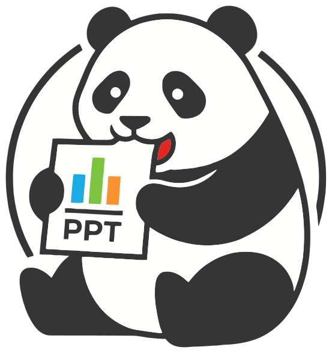
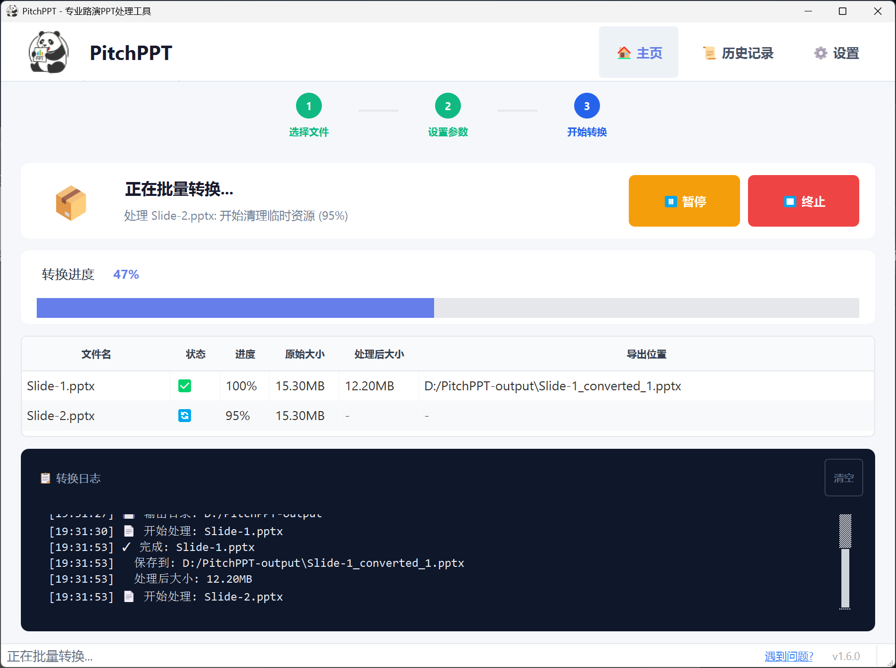

# 🐼 PitchPPT 

<p align="center">
  
</p>

<p align="center">
  <strong>Export PPT to Image-based PPT, Perfectly Protect Content and Precisely Control File Size</strong>
</p>

<p align="center">
  <strong>English</strong> | <a href="README.zh-CN.md">中文</a>
</p>

<p align="center">
  <a href="https://github.com/baojiachen0214/PitchPPT.git">
    
  </a>
  <a href="https://gitee.com/bao-jiachen/PitchPPT.git">
    
  </a>
  
  
</p>

---

## 🎯 Introduction

**PitchPPT** is a professional pitch deck protection tool that exports your PPT as an **image-based PPT** (each slide converted to high-resolution image as background), perfectly preserving the complete PPT structure: annotations, comments, transitions, speaker notes, hyperlinks, etc.

What's more, PitchPPT offers three built-in compression settings to **keep your image-rich presentations lightweight**. Whether you're preparing for a job interview or a funding roadshow with strict file size limits, PitchPPT has you covered.

### Key Features

- 🎯 **Intelligent Volume Control**: Three algorithms for precise size control with <2% error
- 🛡️ **Content Protection**: Export as image-based PPT, tamper-proof design to protect intellectual property
- 🎨 **Quality Optimization**: Smart image quality allocation based on content complexity
- 🖼️ **Multiple Formats**: Support PNG, JPEG, TIFF, WebP, BMP formats; DPI presets from 72 to 600 (up to 16K resolution)
- ⚡ **Batch Processing**: Support multiple files simultaneously
- 🔧 **Structure Preservation**: Keep annotations, transitions, speaker notes, hyperlinks intact

> 📖 **Documentation**: See [docs/](docs/) directory
> - [Algorithm Details](docs/ALGORITHM.md)
> - [FAQ](docs/FAQ.md)
> - [Troubleshooting](docs/TROUBLESHOOTING.md)

---

## 📸 Screenshot

<p align="center">
  
</p>

<p align="center">
  <em>PitchPPT Main Interface - Smart optimization mode with batch processing support</em>
</p>

---

## 📦 Installation

### Requirements
- Windows 10/11 (64-bit)
- Microsoft PowerPoint 2016 or later

### Download
Download the latest version from [GitHub Releases](https://github.com/baojiachen0214/PitchPPT/releases) or [Gitee Releases](https://gitee.com/bao-jiachen/PitchPPT/releases).

### Run from Source
```bash
git clone https://github.com/baojiachen0214/PitchPPT.git
cd PitchPPT
pip install -r requirements.txt
python src\main.py
```

---

## 🎮 Quick Start

### Two Core Modes

PitchPPT offers **two processing modes** to meet different needs:

#### 1️⃣ Standard Mode (Highly Customizable)
- **Purpose**: Fast export of PPT to image-based PPT
- **Features**: Unified image quality settings, quick processing
- **Best For**: General presentations without strict file size requirements

#### 2️⃣ Smart Mode (Precise Size Control)
- **Purpose**: Precisely control output file size
- **Features**: Three intelligent algorithms, error < 2%
- **Best For**: Competitions, roadshows with strict file size limits

### Workflow

1. **Launch**: Run `PitchPPT.exe`
2. **Select Mode**: Choose "Standard Mode" or "Smart Mode"
3. **Add Files**: 
   - Single file: Drag & drop or click "Select File"
   - Batch processing: Click "Batch Mode" to add multiple files
4. **Configure Settings**:
   - **Standard Mode**: Select image quality (High/Medium/Low)
   - **Smart Mode**: Select algorithm and set target file size (MB)
5. **Convert**: Click "Start Conversion" and wait for completion

### Algorithm Selection (Smart Mode)

| Algorithm | Characteristics |
|-----------|-----------------|
| **Average Quota** | Equal quota per page, fast & stable | 
| **Dual-Round Optimization** | Test then adjust, balanced |
| **Iterative Optimization** | Complexity-based, highest accuracy |

### Output Features

✅ **Complete Structure Preservation**:
- Annotations and comments
- Slide transitions and animations
- Speaker notes
- Hyperlinks

✅ **Content Protection**:
- Exported as image-based PPT (each slide becomes a background image)
- Content cannot be easily edited or copied
- Perfect for protecting intellectual property

### Image Format & Quality Options

**Supported Image Formats**

| Format | Description | Best For |
|--------|-------------|----------|
| PNG | Lossless compression, highest quality | Graphics, text-heavy slides |
| JPEG | Lossy compression, smaller size | Photos, complex images |
| TIFF | LZW compression, professional | Print, archival |
| WebP | Modern format, excellent compression | Web, modern applications |
| BMP | Uncompressed, large size | Compatibility |

**DPI/Clarity Presets**

| Preset | DPI | Resolution (16:9) | Best For |
|--------|-----|-------------------|----------|
| Screen | 72 | 1920x1080 (FHD) | Screen display |
| Normal | 150 | ~4000x2250 (4K) | General use |
| HD | 200 | ~5300x2980 | High quality |
| Print | 300 | ~8000x4500 (8K) | Print, projection |
| Ultra HD | 600 | ~16000x9000 (16K) | Maximum quality |

**Smart Mode**: Automatically optimizes resolution from 480px to 4000px height based on target file size.

---

## 📄 License

This project is licensed under the [GNU Affero General Public License v3.0 (AGPLv3)](LICENSE).

---

<p align="center">
  <strong>⭐ If this project helps you, please give us a Star! ⭐</strong>
</p>
